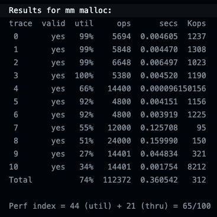
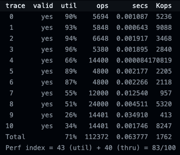
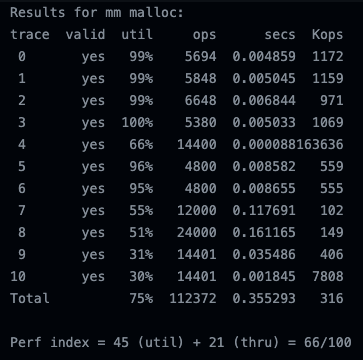

# 묵시적 가용 리스트 (Implicit free list)
메모리 블럭마다 헤더와 풋터를 가지며, 헤더와 풋터를 통해 현재 메모리 블럭의 크기와 할당 여부를 알 수 있다.
각 메모리 블럭마다 헤더와 풋터를 가지기 때문에 페이로드를 가지는 모든 블럭은 최소 16바이트로 구성된다.
가용 메모리 블럭을 찾기 위해 모든 메모리 블럭을 탐색하기 때문에 탐색 방식에 따라 성능에 차이를 보였다.

## 탐색 방식별 성능
### First fit
처음부터 탐색을 시작하여 가장 먼저 찾은 가용 메모리 블럭을 채택하는 방식  
가장 간단하게 구현할 수 있었으나, 처리량과 메모리 이용도에서 낮은 성능을 보였다.  

### Next fit
이전 탐색 결과를 기반으로 중복 탐색을 줄여 First fit을 개선시킨 방식  
이전에 탐색했던 할당된 메모리 블럭은 탐색하지 않고, 메모리 블럭 해제시 해당 블럭을 탐색 시작지점으로 설정하면서 처리량을 극대화시킬 수 있었다.  

### Best fit
모든 메모리 블럭을 탐색하여 가장 적합한 메모리 블럭을 찾는 방식  
현재 필요한 메모리 크기와 적합한 블럭을 찾기에 메모리 이용도를 높일 수 있었다.  

## 한계
묵시적 가용 리스트에서 탐색 방식 개선으로는 성능을 끌어올리는 데에 한계를 보였다. 
묵시적 가용 리스트는 결국 할당된 메모리 블럭까지 탐색 범위에 들어있었기 때문인데, 이를 개선하기 위해 별도로 가용 리스트를 관리하여 탐색 범위를 줄일 수 있다.
또한, realloc에서 특히나 낮은 성능을 보이는 것을 확인했는데, realloc 내부 로직을 개선시킨다면 성능 개선을 기대해볼 수 있겠다.

---
 ***CS:APP Malloc Lab Handout files for students***  

 ***Copyright (c) 2002, R. Bryant and D. O'Hallaron, All rights reserved.*** 
 ***May not be used, modified, or copied without permission.***
